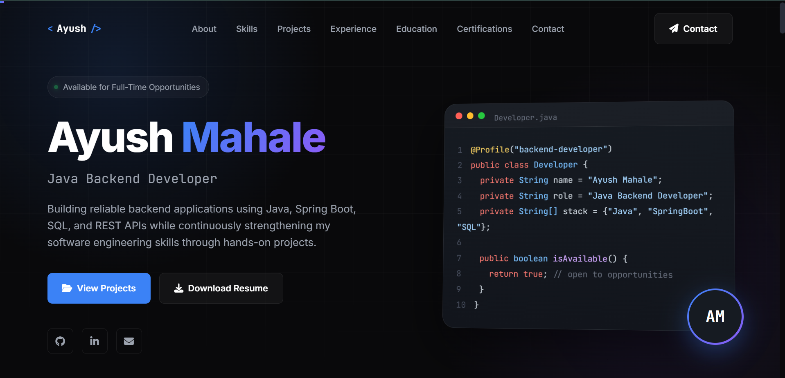

# 🌐 Ayush Mahale | Portfolio

> Personal portfolio showcasing my projects, technical skills, experience, certifications, and resume.

  

  <a href="https://ayushmahale2709.github.io/ayush-portfolio/">
    <strong>🌍 Open Portfolio Website</strong>
  </a>

---

## 📌 About

This repository contains the source code for my personal portfolio website, built to highlight my work, technical expertise, and achievements.

### ✨ Features

- 📱 Fully Responsive Design
- 💼 Professional Project Showcase
- 🛠️ Technical Skills
- 📜 Certifications
- 📄 Resume Download
- 📬 Contact Information
- ⚡ Smooth UI & Animations

---

## 🚀 Live Website

🔗 **https://ayushmahale2709.github.io/ayush-portfolio/**

---

## 🛠️ Tech Stack

- HTML5
- CSS3
- JavaScript
- GitHub Pages

---

## 📷 Preview

---

⭐ If you like this project, consider giving it a star!
